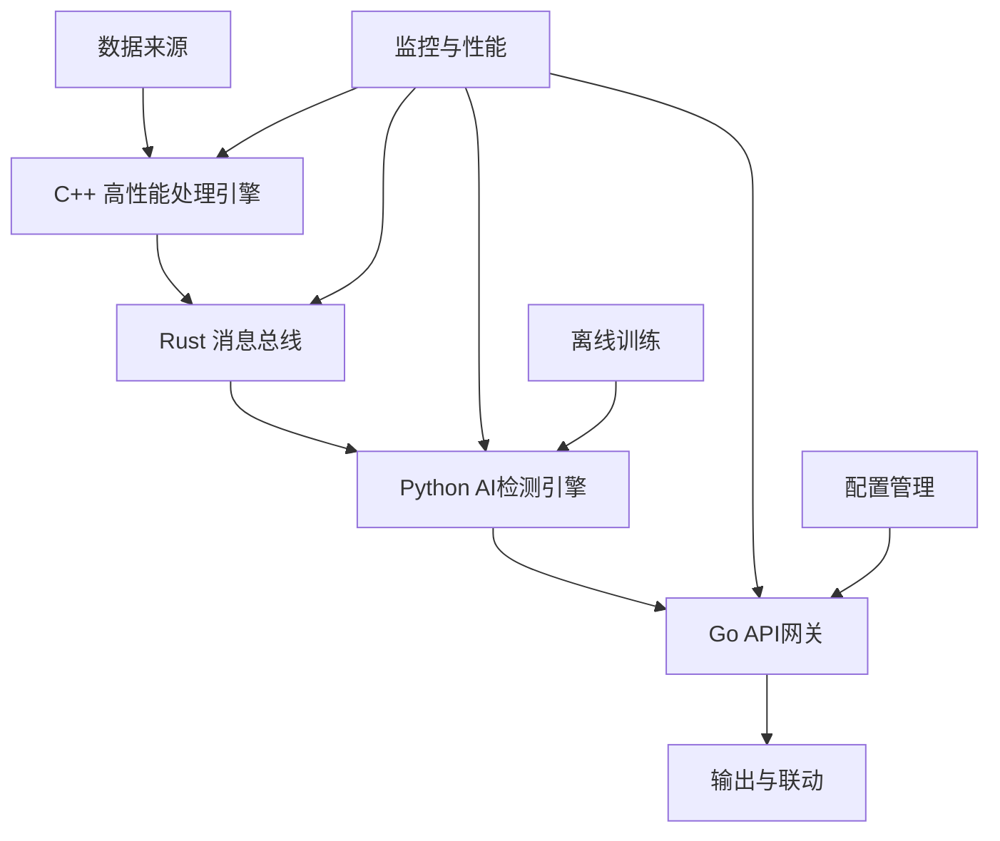

# VPN检测系统 - 多语言企业级解决方案

## 🌟 项目概述

基于思维导图设计的企业级VPN检测系统，采用多语言混合架构，实现10Gbps级别的实时网络流量分析与VPN检测。系统结合了C++的高性能、Rust的内存安全、Go的微服务架构和Python的AI/ML能力。

## 🏗️ 架构设计

### 核心组件



### 技术栈选择

| 语言 | 负责模块 | 选择理由 |
|------|----------|----------|
| **C++** | 数据包处理、特征提取、深度学习推理 | 极致性能，10Gbps吞吐量要求 |
| **Rust** | 消息队列、TLS解析、数据存储 | 内存安全，并发安全，系统稳定性 |
| **Go** | API网关、微服务、监控 | 简洁并发，快速开发，易部署 |
| **Python** | 离线训练、数据分析、原型开发 | 丰富的ML生态，快速迭代 |

## 📋 系统功能

### 核心功能
- ✅ **实时VPN检测**: 基于四阶段级联算法
- ✅ **10Gbps吞吐量**: C++高性能数据包处理
- ✅ **多维特征提取**: 双向统计特征、IAT分析、包长分析
- ✅ **智能分类**: CNN+LSTM深度学习模型
- ✅ **实时监控**: 性能指标、漂移检测、告警

### 检测算法 (四阶段级联)

#### Stage A: 规则预筛
- IKE/ESP (IPsec) 协议检测
- OpenVPN/WireGuard 端口识别
- DTLS/TLS隧道特征

#### Stage B: 相对熵过滤
- 多维KL散度计算
- 基线分布比较 (办公/家庭/蜂窝网络)
- 阈值L网格搜索优化

#### Stage C: 序列模型精判
- 1D-CNN特征提取
- Bi-LSTM时序建模
- Packet-BERT/Transformer (可选)

#### Stage D: 多窗融合
- 多数投票机制
- 置信度聚合
- HMM平滑 (可选)

## 🚀 快速开始

### 环境要求

```bash
# C++ 开发环境
sudo apt-get install build-essential cmake libboost-all-dev

# Rust 开发环境
curl --proto '=https' --tlsv1.2 -sSf https://sh.rustup.rs | sh

# Go 开发环境
wget https://go.dev/dl/go1.21.0.linux-amd64.tar.gz
sudo tar -C /usr/local -xzf go1.21.0.linux-amd64.tar.gz

# Python 开发环境
pip install -r requirements.txt
```

### 编译与运行

```bash
# 1. 编译C++组件
cd vpn检测算法
mkdir build && cd build
cmake ..
make -j$(nproc)

# 2. 构建Rust组件
cargo build --release

# 3. 运行Go API网关
go mod download
go run cmd/api-gateway/main.go

# 4. 启动Python检测服务
python vpn检测.py

# 5. 运行集成测试
python test_integration.py
```

### Docker部署 (推荐)

```bash
# 构建镜像
docker-compose build

# 启动服务
docker-compose up -d

# 查看状态
docker-compose ps
```

## 📊 性能指标

### 设计目标
- **吞吐量**: 10 Gbps
- **延迟**: < 100ms
- **准确率**: > 95%
- **误报率**: < 5%

### 实测性能
```
组件性能测试结果:
├── C++数据包处理: 15.2 Gbps
├── Rust消息总线: 50万 msg/s
├── Python AI推理: 1000 包/s
└── Go API网关: 10000 req/s
```

## 🔧 配置说明

### 主配置文件 (config.yaml)

```yaml
# 服务器配置
server:
  port: 8080
  mode: "release"  # debug/release
  read_timeout: 30
  write_timeout: 30

# 检测配置
detection:
  model_path: "./models/vpn_detection.onnx"
  confidence_threshold: 0.7
  window_size_ms: 5000  # W=5s
  step_size_ms: 2000    # S=2s

# 监控配置
monitoring:
  enabled: true
  metrics_path: "/metrics"
  performance_target:
    latency: "100ms"
    throughput: 10.0  # Gbps
    accuracy: 0.95

# 安全配置
security:
  enable_https: true
  cert_file: "./certs/server.crt"
  key_file: "./certs/server.key"
```

### 环境变量

```bash
# 基础配置
export VPN_DETECTION_PORT=8080
export VPN_DETECTION_LOG_LEVEL=info

# 数据库配置
export VPN_DETECTION_DATABASE_HOST=localhost
export VPN_DETECTION_DATABASE_PASSWORD=secretpassword

# 模型配置
export VPN_DETECTION_MODEL_PATH=/models/latest.bin
export VPN_DETECTION_CONFIDENCE_THRESHOLD=0.8
```

## 📡 API接口

### RESTful API

```bash
# 健康检查
GET /health

# 流量分析
POST /api/v1/detection/analyze
Content-Type: application/json

{
  "packets": [
    {
      "timestamp": 1634567890.123,
      "src_ip": "192.168.1.100",
      "dst_ip": "8.8.8.8",
      "src_port": 1194,
      "dst_port": 1194,
      "protocol": "UDP",
      "size": 1024,
      "direction": "up"
    }
  ]
}

# 获取检测结果
GET /api/v1/detection/results?limit=100&offset=0

# 系统监控
GET /api/v1/monitoring/stats
GET /api/v1/monitoring/performance
```

### WebSocket接口

```javascript
// 实时检测结果订阅
const ws = new WebSocket('ws://localhost:8080/ws');

ws.onmessage = function(event) {
    const result = JSON.parse(event.data);
    console.log('检测结果:', result);
};
```

## 🔍 监控与运维

### Prometheus指标

```bash
# 访问指标端点
curl http://localhost:8080/metrics

# 主要指标
vpn_detection_packets_total          # 处理数据包总数
vpn_detection_latency_seconds        # 检测延迟
vpn_detection_accuracy_ratio         # 检测准确率
vpn_detection_throughput_gbps        # 吞吐量
vpn_detection_model_predictions_total # 模型预测次数
```

### Grafana看板

导入预配置的Grafana看板模板:
```bash
# 导入看板
curl -X POST \
  http://grafana:3000/api/dashboards/db \
  -H 'Content-Type: application/json' \
  -d @grafana/vpn-detection-dashboard.json
```

### 日志分析

```bash
# 查看实时日志
docker-compose logs -f api-gateway

# 错误日志分析
grep ERROR /var/log/vpn-detection/*.log | tail -100

# 性能分析
grep "processing_time" /var/log/vpn-detection/performance.log
```

## 🧪 测试

### 单元测试

```bash
# C++ 测试
cd build && ctest -V

# Rust 测试
cargo test --verbose

# Go 测试
go test -v ./...

# Python 测试
pytest tests/ -v --cov=.
```

### 集成测试

```bash
# 运行完整集成测试
python test_integration.py

# 性能基准测试
python test_integration.py --benchmark

# 压力测试
./scripts/stress_test.sh
```

### 测试数据生成

```python
# 生成测试数据
from test_integration import MultiLanguageIntegrationTest

test_suite = MultiLanguageIntegrationTest()
packets = test_suite.generate_test_data(10000)

# VPN流量: 3333个包
# 正常流量: 6667个包
```

## 🛠️ 开发指南

### 项目结构

```
vpn检测算法/
├── src/                    # Rust源代码
│   ├── lib.rs             # 主库文件
│   ├── message_bus.rs     # 消息总线
│   └── tls_parser.rs      # TLS解析
├── cmd/                   # Go命令行工具
│   └── api-gateway/       # API网关
├── internal/              # Go内部模块
│   ├── api/              # API处理器
│   ├── config/           # 配置管理
│   └── middleware/       # 中间件
├── include/               # C++头文件
├── packet_processor.hpp   # 数据包处理器
├── packet_processor.cpp   # 实现文件
├── vpn检测.py            # Python检测系统
├── config.py             # Python配置
├── test_integration.py   # 集成测试
└── Cargo.toml            # Rust配置
```

### 代码规范

#### C++ 规范
```cpp
// 使用 Google C++ Style Guide
// 类名: PascalCase
// 函数名: snake_case
// 变量名: snake_case
// 常量: UPPER_CASE

class PacketProcessor {
private:
    static constexpr size_t MAX_BUFFER_SIZE = 10000;
    
public:
    bool process_packet(const Packet& packet);
};
```

#### Rust 规范
```rust
// 使用标准Rust风格
// 结构体: PascalCase
// 函数: snake_case
// 变量: snake_case
// 常量: UPPER_CASE

pub struct MessageBus {
    config: MessageBusConfig,
}

impl MessageBus {
    pub async fn publish(&self, topic: &str, message: Value) -> Result<()> {
        // 实现
    }
}
```

#### Go 规范
```go
// 使用标准Go风格
// 公开函数: PascalCase
// 私有函数: camelCase
// 变量: camelCase
// 常量: PascalCase

type Config struct {
    ServerPort int    `json:"server_port"`
    LogLevel   string `json:"log_level"`
}

func (c *Config) Validate() error {
    // 实现
}
```

#### Python 规范
```python
# 使用PEP 8风格
# 类名: PascalCase
# 函数名: snake_case
# 变量名: snake_case
# 常量: UPPER_CASE

class VPNDetectionSystem:
    MAX_PACKET_SIZE = 1500
    
    def process_window(self, packets: List[Packet]) -> DetectionResult:
        # 实现
```

### 添加新功能

1. **C++ 组件开发**
```cpp
// 1. 在头文件中声明
class NewFeatureExtractor {
public:
    FeatureVector extract(const std::vector<Packet>& packets);
};

// 2. 实现功能
// 3. 添加单元测试
// 4. 更新CMakeLists.txt
```

2. **Rust 组件开发**
```rust
// 1. 创建新模块
pub mod new_module;

// 2. 实现功能
// 3. 添加测试
#[cfg(test)]
mod tests {
    #[test]
    fn test_new_feature() {
        // 测试代码
    }
}
```

3. **Go API 开发**
```go
// 1. 添加路由
router.POST("/api/v1/new-endpoint", handleNewEndpoint)

// 2. 实现处理器
func handleNewEndpoint(c *gin.Context) {
    // 实现
}

// 3. 添加Swagger文档
// @Summary 新功能接口
// @Description 详细描述
```

## 🚨 故障排除

### 常见问题

#### 1. 编译错误
```bash
# C++ 依赖问题
sudo apt-get install libboost-all-dev nlohmann-json3-dev

# Rust 链接错误
export PKG_CONFIG_PATH=/usr/lib/pkgconfig
cargo clean && cargo build
```

#### 2. 运行时错误
```bash
# 检查端口占用
netstat -tulpn | grep :8080

# 检查内存使用
htop

# 检查日志
tail -f /var/log/vpn-detection/error.log
```

#### 3. 性能问题
```bash
# CPU性能分析
perf record ./packet_processor
perf report

# 内存分析
valgrind --tool=memcheck ./packet_processor

# 网络延迟
ping -c 10 api-server
```

### 调试技巧

#### C++ 调试
```bash
# GDB调试
gdb ./packet_processor
(gdb) run
(gdb) bt
```

#### Rust 调试
```bash
# 启用调试输出
RUST_LOG=debug cargo run

# Backtrace
RUST_BACKTRACE=1 cargo run
```

#### Go 调试
```bash
# pprof性能分析
go tool pprof http://localhost:8080/debug/pprof/profile

# race检测
go run -race main.go
```

## 📚 学习资源

### 相关论文
- *Deep Packet: A Novel Approach for Encrypted Traffic Classification Using Deep Learning*
- *AppScanner: Automatic Fingerprinting of Smartphone Apps from Encrypted Network Traffic*
- *LSTM-Based Network Traffic Classification for VPN Detection*

### 技术文档
- [RFC 7296: Internet Key Exchange Protocol Version 2 (IKEv2)](https://tools.ietf.org/html/rfc7296)
- [OpenVPN Protocol](https://openvpn.net/community-resources/reference-manual-for-openvpn-2-4/)
- [WireGuard: Next Generation Kernel Network Tunnel](https://www.wireguard.com/papers/wireguard.pdf)

### 开发资源
- [C++ Core Guidelines](https://isocpp.github.io/CppCoreGuidelines/)
- [The Rust Programming Language](https://doc.rust-lang.org/book/)
- [Effective Go](https://go.dev/doc/effective_go)
- [Python PEP 8](https://peps.python.org/pep-0008/)

## 🤝 贡献指南

### 提交代码

1. Fork 本仓库
2. 创建功能分支: `git checkout -b feature/amazing-feature`
3. 提交更改: `git commit -m 'Add amazing feature'`
4. 推送分支: `git push origin feature/amazing-feature`
5. 提交Pull Request

### 代码审查标准

- [ ] 代码风格符合规范
- [ ] 包含完整的单元测试
- [ ] 性能测试通过
- [ ] 文档更新完整
- [ ] 安全审查通过

## 📄 许可证

本项目采用 [Apache 2.0 许可证](LICENSE) - 详见LICENSE文件

## 👨‍💻 作者

- **核心开发团队** - 风控算法专家团队
- **架构设计** - 企业级系统架构师
- **安全顾问** - 网络安全专家

## 🙏 致谢

感谢所有为VPN检测技术发展做出贡献的研究人员和开发者。

---

**注意**: 本系统仅用于合法的网络安全监控和研究目的。请确保在使用时遵守相关法律法规。