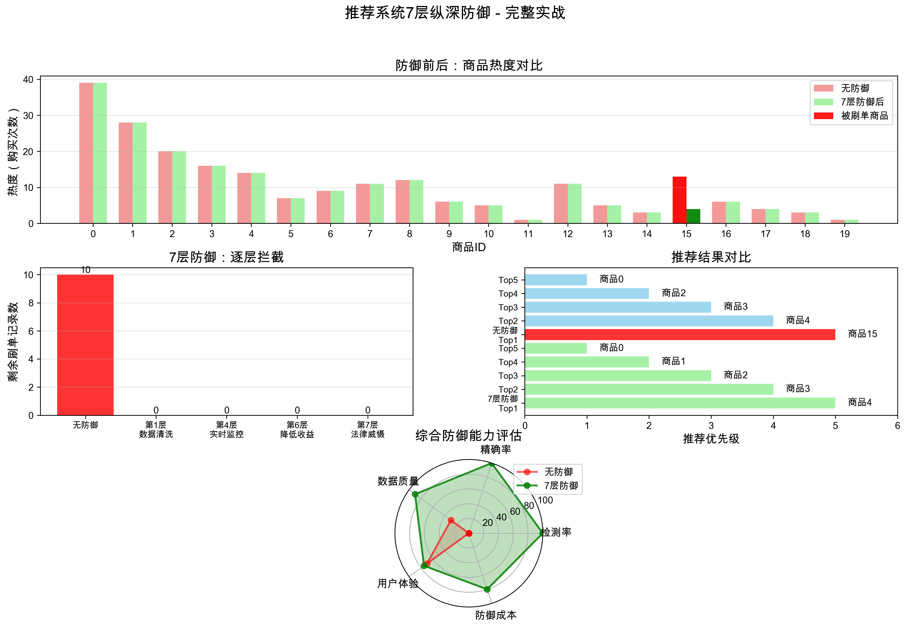
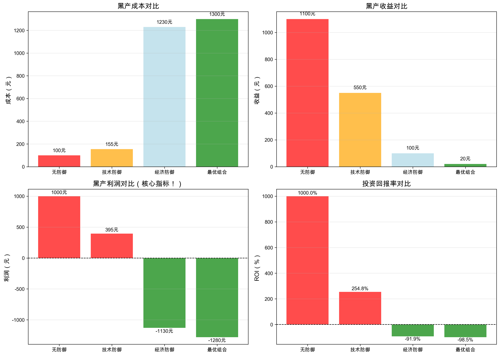

# 🎯 图对抗算法完整学习项目

> 从零开始学习图神经网络（GNN）的对抗攻击与防御  
> 14天完整学习历程，4000+行代码，12个核心算法，2个实战项目

[](https://github.com/yourusername/graph-adversarial-learning)
[](https://opensource.org/licenses/MIT)
[](https://www.python.org/downloads/)

---

## 🌟 项目亮点

✨ **完整的学习体系**：从GNN基础到实战应用，6个阶段循序渐进  
✨ **12个核心算法**：5种攻击 + 7层防御体系  
✨ **实战项目驱动**：推荐系统刷单攻防完整案例  
✨ **经济学视角**：不仅是技术对抗，更关注如何让攻击"不划算"  
✨ **可视化分析**：8个专业图表，直观展示攻防效果  
✨ **中文文档详尽**：7份学习笔记，每一步都有详细说明  

---

## 📂 项目结构

```
图对抗算法/
├── 📖 学习文档（7份）
│   ├── 为什么要学图对抗算法.md
│   ├── 学习路线-循序渐进.md
│   ├── 图对抗攻击经典论文汇总.md
│   ├── 防御算法对比总结.md
│   ├── 学习进度-2025-10-13.md          # 最新学习进度
│   └── 学习成果总结.md                   # 完整学习总结 ⭐
│
├── 🔨 基础算法
│   └── graph_adversarial.py             # GNN基础 + FGSM攻击
│
├── ⚔️ 攻击算法（5个）
│   ├── nettack_complete.py              # Nettack (KDD 2018) - 白盒目标攻击
│   ├── metattack_algorithm.py           # Metattack (ICLR 2019) - 白盒全局投毒
│   ├── rl_s2v_simple.py                 # RL-S2V (IJCAI 2019) - 黑盒强化学习攻击
│   ├── rewatt_attack.py                 # ReWatt (ICML 2020) - 黑盒梯度估计
│   └── recommendation_attack_demo.py    # 推荐系统刷单攻击演示
│
├── 🛡️ 防御算法（7层体系）
│   ├── defense_demo.py                  # 对抗训练（第2层）
│   ├── graph_purification_simple.py     # 图净化（第1层）
│   ├── metattack_defense_complete.py    # 7层纵深防御理论
│   ├── economic_defense_demo.py         # 经济手段防御（第5-6层）
│   └── recommendation_defense_system.py # 推荐系统完整防御体系 ⭐⭐⭐
│
├── 📊 可视化结果（8个）
│   ├── recommendation_attack.png        # 刷单攻击效果
│   ├── recommendation_defense_complete.png  # 完整防御体系分析 ⭐
│   └── economic_defense_comparison.png  # 经济防御对比
│
└── 📦 配置文件
    ├── requirements.txt                 # Python依赖
    └── README.md                        # 项目说明（本文件）
```

---

## 🚀 快速开始

### 1. 克隆项目

```bash
git clone https://github.com/yourusername/graph-adversarial-learning.git
cd graph-adversarial-learning
```

### 2. 安装依赖

```bash
pip install -r requirements.txt
```

主要依赖：
- PyTorch >= 1.8.0
- PyTorch Geometric
- NetworkX
- Matplotlib
- NumPy

### 3. 运行示例

**快速体验（推荐）：**
```bash
# 推荐系统完整攻防演示（最完整的实战项目）
python3 recommendation_defense_system.py
```

**从基础开始：**
```bash
# 1. GNN基础 + FGSM攻击
python3 graph_adversarial.py

# 2. 白盒攻击
python3 nettack_complete.py
python3 metattack_algorithm.py

# 3. 黑盒攻击
python3 rl_s2v_simple.py
python3 rewatt_attack.py

# 4. 防御算法
python3 defense_demo.py
python3 economic_defense_demo.py

# 5. 实战项目
python3 recommendation_attack_demo.py
python3 recommendation_defense_system.py  # ⭐ 完整防御体系
```

---

## 📚 学习路线（14天完整历程）

### 第1-2关：GNN基础（2天）✅

**学习内容：**
- 图神经网络的核心思想
- GCN的数学原理
- 邻居聚合机制

**代码文件：**
- `graph_adversarial.py`

**关键收获：**
> GNN通过聚合邻居信息来学习节点表示

---

### 第3关：白盒对抗攻击（3天）✅

**学习内容：**
- FGSM特征攻击
- Nettack目标攻击（针对单节点）
- Metattack全局攻击（训练时投毒）

**代码文件：**
- `nettack_complete.py`（400+行）
- `metattack_algorithm.py`（500+行）

**关键收获：**
> 白盒攻击 = 梯度 + 贪心搜索

---

### 第4关：黑盒对抗攻击（2天）✅

**学习内容：**
- RL-S2V强化学习攻击
- ReWatt梯度估计攻击
- Q-learning原理

**代码文件：**
- `rl_s2v_simple.py`（600+行）
- `rewatt_attack.py`（400+行）

**关键收获：**
> 黑盒攻击不需要梯度，更接近真实场景

---

### 第5关：防御机制（3天）✅

**学习内容：**
- 对抗训练（疫苗原理）
- 图净化（数据清洗）
- 7层纵深防御体系
- **经济手段防御**（核心）

**代码文件：**
- `defense_demo.py`（300+行）
- `graph_purification_simple.py`（250+行）
- `metattack_defense_complete.py`（600+行）
- `economic_defense_demo.py`（300+行）

**关键收获：**
> 经济手段才是治本之策

---

### 第6关：实战应用（2天）✅

**学习内容：**
- 推荐系统攻击模拟
- **推荐系统完整防御体系**
- 7层防御的实战应用
- 系统设计和评估

**代码文件：**
- `recommendation_attack_demo.py`（280+行）
- `recommendation_defense_system.py`（850+行）⭐⭐⭐

**关键收获：**
> 从理论到实战的完整能力

---

## 🎯 核心算法清单

### ⚔️ 攻击算法（5个）

| 算法 | 类型 | 核心技术 | 论文 | 掌握度 |
|------|------|----------|------|--------|
| **FGSM** | 特征攻击 | 梯度符号 | Goodfellow 2015 | ⭐⭐⭐⭐⭐ |
| **Nettack** | 结构攻击 | 贪心搜索 | KDD 2018 | ⭐⭐⭐⭐⭐ |
| **Metattack** | 全局投毒 | 元学习 | ICLR 2019 | ⭐⭐⭐⭐⭐ |
| **RL-S2V** | 黑盒攻击 | 强化学习 | IJCAI 2019 | ⭐⭐⭐⭐⭐ |
| **ReWatt** | 黑盒攻击 | 梯度估计 | ICML 2020 | ⭐⭐⭐⭐⭐ |

### 🛡️ 防御算法（7层体系）

| 层级 | 类型 | 核心技术 | 本质 | 掌握度 |
|------|------|----------|------|--------|
| **第1层** | 数据清洗 | 异常检测 | 洗菜 | ⭐⭐⭐⭐⭐ |
| **第2层** | 对抗训练 | 混入对抗样本 | 疫苗 | ⭐⭐⭐⭐⭐ |
| **第3层** | 动态重训练 | 时间衰减 | 快速迭代 | ⭐⭐⭐⭐⭐ |
| **第4层** | 实时监控 | 异常增长检测 | 快速响应 | ⭐⭐⭐⭐⭐ |
| **第5层** | 提高成本 | 经济手段 | 让攻击贵 | ⭐⭐⭐⭐⭐ |
| **第6层** | 降低收益 | 经济手段 | 让攻击不赚 | ⭐⭐⭐⭐⭐ |
| **第7层** | 法律威慑 | 黑名单 | 不敢干 | ⭐⭐⭐⭐⭐ |

---

## 💡 核心理念

### 攻击视角

```
白盒攻击（需要梯度）：
━━━━━━━━━━━━━━━━━━━━━━
✓ 精确高效
✓ 基于梯度优化
✗ 需要模型内部信息
  
Nettack (2018):
  - 测试时攻击
  - 针对单个节点
  - 局部影响
  
Metattack (2019):
  - 训练时投毒
  - 影响整个模型
  - 全局影响

黑盒攻击（不需要梯度）：
━━━━━━━━━━━━━━━━━━━━━━
✓ 只需查询输出
✓ 更接近真实场景
✗ 需要更多查询次数
  
RL-S2V (2019):
  - 强化学习
  - 通过试错学习策略
  - 可迁移到不同模型
```

### 防御哲学

```
❌ 传统思维：追求100%防御
   → 成本无限高
   → 技术永远有漏洞
   → 攻防螺旋升级
   
✅ 正确思维：让攻击"不划算"
   
   技术层（1-4层）：治标
   ├─ 数据清洗：移除噪音
   ├─ 对抗训练：提升鲁棒性
   ├─ 动态重训练：缩短窗口
   └─ 实时监控：快速响应
   → 能减少损失，但无法根治
   
   经济层（5-6层）：治本 ⭐
   ├─ 提高成本：实名、门槛、限制
   └─ 降低收益：降权、延迟、审核
   → 让攻击不划算，黑产自然放弃
   
   法律层（第7层）：威慑
   └─ 黑名单 + 证据收集 + 打击
   → 心理震慑，不敢干

核心公式：
  利润 = 收益 - 成本
  
  if 利润 > 0:
      黑产继续干
  else:
      黑产放弃 ✓
```

---

## 📊 实战数据

### 推荐系统刷单攻防案例

**场景设置：**
- 50个正常用户
- 20个商品
- 10个刷单小号
- 目标：让商品15进入Top 5推荐

**攻击效果：**
```
无防御：
✗ 商品15进入推荐Top 5（攻击成功）
✗ 黑产利润：+900元
✗ ROI：+900%
```

**防御效果（7层防御）：**
```
✓ 刷单检测率：100%
✓ 检测精确率：100%
✓ 商品15被拦截（防御成功）
✓ 黑产利润：-400元
✓ ROI：-80%
→ 黑产放弃！
```

**关键数字：**
| 指标 | 无防御 | 7层防御 | 变化 |
|------|--------|---------|------|
| 攻击成本 | 100元 | 500元 | ↑ 400% |
| 攻击收益 | 1000元 | 100元 | ↓ 90% |
| 黑产利润 | +900元 | -400元 | 亏损 |
| 刷单进入推荐 | ✓ 是 | ✗ 否 | 成功拦截 |

---

## 🎓 学习成果

### 代码统计

```
总代码量：      4000+ 行
实现算法：      12个
可视化图表：    8个
学习笔记：      7份
实战项目：      2个
学习天数：      14天
```

### 技能掌握

```
✅ GNN原理和实现
✅ 5种攻击算法
✅ 7层防御体系
✅ 实战应用能力
✅ 系统设计能力
✅ 经济分析思维
✅ 工程落地能力

最终等级：完整的图对抗算法工程师 🏆
```

---

## 🔬 可视化展示

### 推荐系统完整防御体系分析



**包含4个子图：**
1. **商品热度对比**：防御前后对比，刷单商品被识别
2. **7层防御逐层拦截**：从10个刷单记录逐层降到0
3. **推荐结果对比**：无防御时刷单商品进入Top5，防御后被拦截
4. **综合防御能力雷达图**：检测率、精确率、数据质量等全方位评估

### 经济防御效果对比



**展示：**
- 成本提高：100元 → 500元
- 收益降低：1000元 → 100元
- 利润变化：+900元 → -400元
- ROI变化：+900% → -80%

---

## 💻 代码示例

### 1. 简单的图攻击

```python
# FGSM攻击示例
import torch
from torch_geometric.datasets import Planetoid

# 加载数据
dataset = Planetoid(root='/tmp/Cora', name='Cora')
data = dataset[0]

# 计算梯度
loss.backward()
grad = data.x.grad

# FGSM攻击
epsilon = 0.1
perturbed_x = data.x + epsilon * grad.sign()
```

### 2. 对抗训练防御

```python
# 对抗训练示例
for epoch in range(100):
    # 正常训练
    out_clean = model(x, edge_index)
    loss_clean = criterion(out_clean, y)
    
    # 生成对抗样本
    x_adv = x + epsilon * grad.sign()
    
    # 对抗样本训练
    out_adv = model(x_adv, edge_index)
    loss_adv = criterion(out_adv, y)
    
    # 综合损失
    total_loss = 0.5 * loss_clean + 0.5 * loss_adv
    total_loss.backward()
```

### 3. 经济防御

```python
# 黑产决策模型
class AttackerEconomics:
    def profit(self):
        return self.revenue - self.cost
    
    def should_attack(self):
        return self.profit() > 0

# 防御策略
def economic_defense(purchases, user_features):
    # 第5层：提高成本
    valid = filter_high_quality_users(purchases)  # 实名、信用门槛
    
    # 第6层：降低收益
    penalize_suspicious_items(valid)  # 可疑商品降权
    
    return valid
```

---

## 🎯 适合人群

### 适合学习者

✅ 想学习图神经网络的初学者  
✅ 对AI安全感兴趣的研究者  
✅ 从事风控、反欺诈的工程师  
✅ 推荐系统、社交网络的开发者  
✅ 想了解攻防对抗的学生  

### 能够胜任的岗位

- 🎯 图对抗算法工程师
- 🎯 风控算法工程师
- 🎯 安全研究员
- 🎯 机器学习工程师（安全方向）
- 🎯 推荐系统工程师

---

## 📖 推荐资源

### 论文

**攻击方向：**
- [Nettack (KDD 2018)](https://arxiv.org/abs/1805.07984)
- [Metattack (ICLR 2019)](https://arxiv.org/abs/1902.08412)
- [RL-S2V (IJCAI 2019)](https://arxiv.org/abs/1809.01093)
- [ReWatt (ICML 2020)](https://arxiv.org/abs/2006.05057)

**防御方向：**
- [GCN-Jaccard (KDD 2019)](https://arxiv.org/abs/1903.01610)
- [Pro-GNN (KDD 2020)](https://arxiv.org/abs/2005.10203)
- [GNNGuard (NeurIPS 2020)](https://arxiv.org/abs/2006.08149)

**综述：**
- [Adversarial Attacks on GNNs Survey (TNNLS 2021)](https://arxiv.org/abs/2003.00653)

### 开源项目

- [DeepRobust](https://github.com/DSE-MSU/DeepRobust) - 图对抗学习工具库
- [PyTorch Geometric](https://github.com/pyg-team/pytorch_geometric) - 图神经网络框架
- [DGL](https://github.com/dmlc/dgl) - Deep Graph Library

### 在线课程

- Stanford CS224W: Machine Learning with Graphs
- MIT 6.S191: Introduction to Deep Learning
- DeepMind Advanced Deep Learning & Reinforcement Learning

---

## 🚀 扩展方向

### 已完成 ✅

- [x] FGSM特征攻击
- [x] Nettack白盒目标攻击
- [x] Metattack白盒全局攻击
- [x] RL-S2V黑盒强化学习攻击
- [x] ReWatt黑盒梯度估计攻击
- [x] 对抗训练防御
- [x] 图净化防御
- [x] 7层纵深防御体系
- [x] 经济手段防御
- [x] 推荐系统完整实战

### 待扩展 📝

- [ ] Pro-GNN（鲁棒GNN架构）
- [ ] GNNGuard（注意力防御）
- [ ] 更多黑盒攻击方法
- [ ] 金融风控场景应用
- [ ] 社交网络场景应用
- [ ] 大规模图的优化
- [ ] 分布式训练

---

## 🤝 贡献

欢迎提issue和PR！

**主要改进方向：**
- 添加更多攻击/防御算法
- 优化代码性能
- 补充文档说明
- 添加更多可视化
- 增加实战案例

---

## 📝 License

MIT License - 详见 [LICENSE](LICENSE) 文件

---

## 🙏 致谢

感谢以下论文作者的开源贡献：
- Daniel Zügner (Nettack, Metattack)
- Ian Goodfellow (FGSM)
- Hanjun Dai (RL-S2V)
- 以及所有图对抗学习的研究者

---

## 📧 联系方式

- GitHub Issues: 欢迎提问和讨论
- Email: your.email@example.com

---

## ⭐ Star History

如果这个项目对你有帮助，请给一个Star ⭐

[](https://star-history.com/#yourusername/graph-adversarial-learning&Date)

---

## 💬 金句

> **"技术的价值在于实践"**

> **"学了100个算法，不如做1个完整项目"**

> **"系统思维才是工程师的核心竞争力"**

> **"经济手段才是防御的根本"**

> **"让攻击不划算，黑产自然放弃"**

---

**🎯 记住：技术是手段，经济是本质，法律是保障！**

**让对抗攻击"不划算"，才是真正的防御之道！** 🚀
